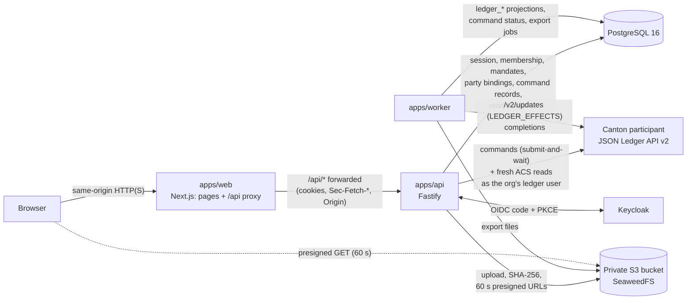
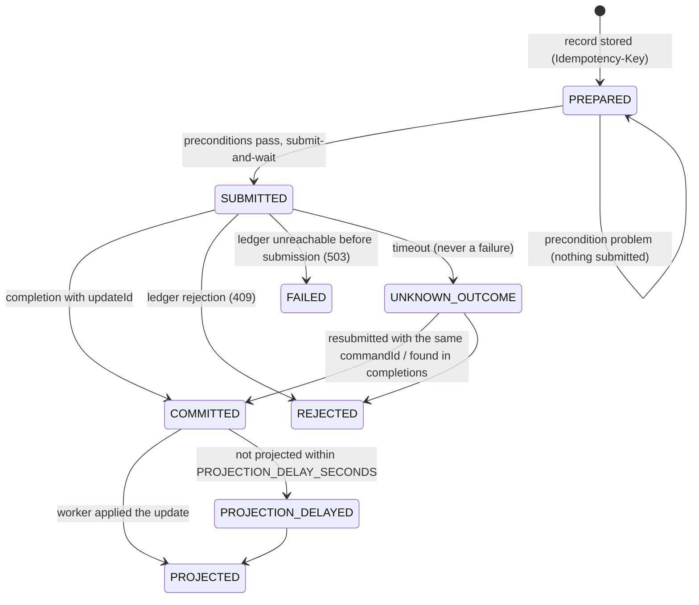

# Architecture overview

How the pieces fit together as built at commit `e320c59` (2026-10-02). Decisions and pinned versions: [ADR-0001](ADR-0001-architecture-and-versions.md). Contracts, choices and invariants: [daml-model.md](daml-model.md). Limits: [`docs/limitations.md`](../limitations.md).

## 1. Components

| Component | Package | Runs as | Talks to |
|---|---|---|---|
| Web | `apps/web` (Next.js 16) | `next start` (or a standalone container) | Browser; the API through its same-origin `/api/*` proxy |
| API | `apps/api` (Fastify 5, tsx) | Long-running Node service | PostgreSQL, object storage, Canton JSON Ledger API v2, OIDC provider |
| Worker | `apps/worker` (tsx) | Long-running Node process, health on port 4100 | Canton (`/v2/updates`, completions), PostgreSQL, object storage |
| Domain | `packages/domain` | Library (web, API, worker, mock) | Policy, presenters, state vocabularies, money, copy, fixtures |
| Persistence | `packages/db` | Library (API, worker) | Drizzle schema, migrations, projection, read model |
| Ledger client | `packages/canton` | Library (API, worker) | Typed JSON Ledger API v2 client, HMAC token provider |
| Daml | `daml/collara` | DARs uploaded to the participant | `collara-contracts`, `collara-governance`, vendored DM DARs |

## 2. Request flow (LOCALNET)

A mutation, step by step:

1. The browser calls `/api/...` on the web origin. The Next route handler forwards it to `API_INTERNAL_ORIGIN` with the cookie, `Sec-Fetch-*` and `Origin` headers (a browser `Authorization` header is dropped).
2. The API checks cross-site headers, loads the session and resolves the actor: user → membership → roles and mandates → party bindings. Nothing from the browser decides the organization, party or role.
3. It loads the stakeholder-filtered facts from the read model and evaluates the domain policy (`can`) and workflow preconditions. Unrelated → 404-shaped `unavailable`; related but not allowed → 403.
4. It stores a command record for the `Idempotency-Key`, reads the current contracts **fresh from the ledger ACS** as the organization's ledger user (never from projections), and submits the Daml command with a deterministic `commandId`.
5. The ledger re-checks every invariant (signatories, controllers, consuming control token, versions, expiries). The API answers 200 with the `updateId`, 202 while the outcome is pending, 409 on a rejection, or 503 when the ledger is unavailable; nothing is simulated.
6. The worker projects the resulting update into PostgreSQL and marks the command `PROJECTED`; reads then show the new state.

**UI_MOCK** has none of this: the browser loads the code-split mock client (`@collara/api-client/mock`), which runs the same domain policy and presenters over in-memory synthetic fixtures. Mutations are recorded in the tab only and never claim ledger confirmation. The banner reads `Synthetic demo data — UI mockup.`; in LOCALNET it reads `Synthetic demo data — Canton LocalNet.`.

## 3. Sources of truth

| Data | Authoritative store | Notes |
|---|---|---|
| Asset registration, control token and lock, evidence anchors (manifest hash and version), verification requests and attestations, shares and consents, lender assessments and decisions, financing proposals and agreements, activation authorizations, release requests and decisions, audit grants, verifier registry and governance | **Canton ledger** (Daml contracts) | Editing a projection never changes ledger truth. |
| Users, organizations, memberships, mandates, party bindings, ledger users | PostgreSQL | Mandates are off-ledger by design (analyst vs approver). |
| Sessions, command records (idempotency, lifecycle, submission context) | PostgreSQL | |
| Cases (title, purpose, requested principal), evidence document metadata, export jobs, pilot requests, operational audit events, notifications | PostgreSQL (application records) | Case creation and proposal drafts are application records, not ledger transactions. |
| Projections: `ledger_updates`, `ledger_contracts` (with signatories, observers), `ledger_events`, `ledger_sources` (checkpoints) | PostgreSQL, **derived** from the ledger | Rebuilt by the worker; never written by the API. |
| Document bytes (`quarantine/` then `evidence/`), export files (`exports/<org>/<report>`) | Private S3-compatible bucket | Only hashes and opaque references go on the ledger. |
| Permission matrix, disclosure rules, state vocabularies, approved copy | `packages/domain` | Shared by API, worker, UI_MOCK and `/docs`. |

## 4. Who operates what

| Organization | Acts on the ledger as | Stores its documents | In this demo |
|---|---|---|---|
| Collara (registrar / operator) | `CollaraRegistrar`, through the API's registry service only | — | Runs every node and service below |
| Demo Manufacturer (borrower) | `DemoManufacturer` via `borrower-svc` | Owner documents, through the API | Hosted on the one local participant |
| Demo CNC Dealer | `DemoCNCDealer` via `dealer-svc` | Its own contributions, through the API | Same participant |
| Demo Verifier | `DemoVerifier` via `verifier-svc` | Inspection documents, through the API | Same participant |
| Demo Lender A / B | `DemoLenderA` / `DemoLenderB` via `lender-a-svc` / `lender-b-svc` | — (reads shared documents) | Same participant |
| Demo Auditor | `DemoAuditor` via `auditor-svc` | — | Same participant |
| Governance seats 1–3 | `GovSeat1..3` via `gov-seat-N-svc` (readAs `CollaraGovernance`) | — | Same participant (Tier A) |

In the local demo **one operator runs the participant, the API, the worker, PostgreSQL and the object store for every organization**. The API holds every organization's ledger-user credential and acts for whichever organization the session's membership resolves to. Document bytes for all organizations sit in one bucket, served only after a per-request access check. This shows the authorization and disclosure model; it does not show operator independence. An optional 3-participant sandbox places the borrower and dealer on `participant2` and Lender A and seat 1 on `participant3` (a proposal for privacy tests; witness-level tests have not been run). A multi-operator deployment, where each organization runs or contracts its own participant and credentials, is not built.

## 5. Command lifecycle

- The record is scoped to (actor, organization, operation, payload hash); reusing a key with another payload is a 409.
- `commandId` is deterministic from the record; each attempt gets a new `submissionId`. Canton deduplicates a resubmission (`DUPLICATE_COMMAND` returns the original completion).
- Before submitting, the runner records the ledger user, `actAs`, ledger source and ledger end, so the worker can reconcile an `UNKNOWN_OUTCOME` from exactly that user's completions.
- The UI shows `Confirmed on the ledger.` only with an `updateId`, and `The action is confirmed. This view is still synchronizing.` while the projection lags.

## 6. Projection worker

- One loop per configured participant source, reading `/v2/updates` with the `LEDGER_EFFECTS` transaction shape as the read-only `projector-svc` user, from a durable checkpoint in `ledger_sources`.
- Each transaction is applied atomically; rows are keyed by update id and node id and inserted idempotently, so a replay or a restart converges (verified by the worker's live kill/restart IT, commit `1107971`).
- Contracts are stored with their signatories and observers; archive events keep the exercising choice, argument and acting parties, which is how terminal outcomes without a successor contract are read.
- **Reset detection:** a new participant id or a ledger end behind the checkpoint marks the source `RESET_DETECTED` and stops projecting it; only an explicit operator command (`pnpm --filter @collara/worker projection:reset -- --source <source> --yes`, which rebuilds the source from offset 0) clears it.
- It also advances command states (`PROJECTED`, `PROJECTION_DELAYED`), reconciles `UNKNOWN_OUTCOME` commands, and runs export jobs from leased PostgreSQL job rows (scoped JSON/CSV with a cut-off, a watermark and a SHA-256 checksum, written to private storage).
- `GET /healthz` reports each source's checkpoint, lag, last applied time and reset state.

## 7. Privacy model

Layered, from the ledger outwards:

1. **Daml stakeholders.** Terms exist only in contracts whose stakeholders are the borrower and the selected lender; the activation authorization, lock and release carry references, never terms. Lender B is never a stakeholder of CL-001 contracts; the auditor observes only `AuditGrant`s. IDE-ledger tests check this after each walkthrough step (daml-model.md §5, §6).
2. **Participant hosting.** In the single-participant demo, one node hosts every party, so its operator sees everything: **not a privacy boundary**. The 3-participant witness tests have not been run.
3. **Least-privilege ledger users.** Each organization's user can act and read only as its own party (seats also read the governance party). The worker's projector user reads every party on its participant: a privileged operator credential.
4. **Read model.** A contract is visible to a viewer only when one of the viewer's parties is a signatory or observer; witnessing (fetches, divulgence) never grants visibility. An auditor's grant adds only the grantor's view of that one case.
5. **Presenters.** `packages/domain/src/presenters.ts` omits fields by role and mandate on the server (terms, internal notes, technical refs, …) before anything is serialized; a null result is a 404-shaped answer that never reveals existence. See [`docs/permissions.md`](../permissions.md).
6. **Documents.** Private bucket, no public policy; downloads are 60-second presigned URLs issued after a fresh share or ownership check.
7. **Logs.** Authorization and cookie headers, tokens, OIDC codes and financing-term fields are redacted.

UI_MOCK ships its synthetic fixtures to the browser. It is a UI mockup, not a privacy demonstration.
