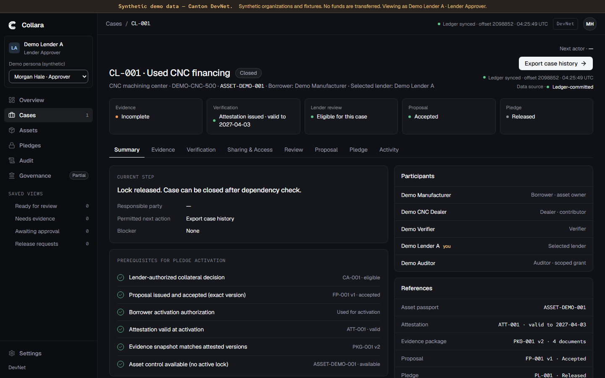

# DevNet run evidence

Real, synthetic-data run of the full Collara workflow on the **HackCanton shared DevNet participant** (NODERS). No funds move; a Collara lock does not replace a legal lien registration.

- **Date:** 2026-10-05T04:24Z
- **Repo commit:** `d47f962`
- **Network:** Canton DevNet (not a local sandbox). JSON Ledger API `https://ledger-api-json.participant.hackcanton-01.devnet.naas.noders.services`, Canton 3.5.19.
- **Participant:** `hackcanton-devnet-3::12204a9d883d1158141d8f099d06dd2e42cb52615deb42da5a46f042c8d0e1dbdf0e`
- **Synchronizer:** `global` (`global-domain::1220be58c29e…`)
- **Tenant ledger user:** `9c376537-054a-4e15-b828-c9eb58c2c64d` — one tenant user holds CanActAs on all 11 project parties (a privileged project-operator credential, **not** credential isolation between organisations).
- **Run namespace:** `collara-devnet-r202610050410`
- **Parties:** `9c376537-<Role>::1220…` for CollaraRegistrar, CollaraGovernance, GovSeat1–3, DemoManufacturer, DemoCNCDealer, DemoVerifier, DemoLenderA, DemoLenderB, DemoAuditor.
- **Packages uploaded + vetted:** governance-core-v1 0.1.0 (`361d1f28…`), collara-contracts 0.2.0 (`1c0e5e62…`), collara-governance 0.1.0, governance-action-v1 0.1.0, splice-util 0.1.4.

## Bootstrap — Tier A governance (clean-start B1–B8, all COMMITTED)

Includes the 2-of-3 governed verifier registry: B3 propose, B4 confirm (seat 1), B5 confirm (seat 2), B6 execute, then config + verifier status mirror.

| Step | Actor | Offset |
|---|---|---|
| B1 create AssetRegistry | registrar | 2097686 |
| B2 create GovernanceRules | governance | 2097693 |
| B3 propose add verifier | gov seat 1 | 2097707 |
| B4 confirm | gov seat 1 | 2097720 |
| B5 confirm | gov seat 2 | 2097723 |
| B6 execute | gov seat 2 | 2097729 |
| B7 create CollaraConfig | registrar | 2097738 |
| B8 publish verifier status | registrar | 2097747 |

First update id: `12205dd84f8eeb9f960bfdd9ee834335b3bce8a12ca36dbe8b9a4a84245eadadbba9` at offset 2097686.

## Main fixture (CL-001, M1–M18, all COMMITTED, offsets 2097816–2097938)

Registration, dealer contribution, evidence manifest v1→v2, verification request + change request + attestation ATT-001, dealer consent, package share to Lender A, control share, attestation disclosure, lender assessment.

## Full workflow through the application API (same endpoints the UI calls; all COMMITTED on DevNet, none simulated)

| Step | Endpoint | Update id |
|---|---|---|
| 1 analyst save assessment | POST /cases/CL-001/assessments | `12207120ffd22014…` |
| 2 analyst submit for approval | POST /reviews/CA-001/submit-for-approval | `1220bf06f943c24b…` |
| 3 approver decide ELIGIBLE | POST /reviews/CA-001/decision | `1220809364126414…` |
| 4 approver issue proposal FP-001 | POST /cases/CL-001/proposals | `12209840729c28e1…` |
| 5 borrower accept v1 | POST /proposals/FP-001/acceptance | `12202a6176b78299…` |
| 6 borrower authorize activation | POST /proposals/FP-001/activation-authorization | `1220ece05aeb45f8…` |
| 7 approver activate pledge PL-001 | POST /cases/CL-001/pledge-activation | `1220f23737949bd0…` |
| 8 borrower request release | POST /pledges/PL-001/release-requests | `1220d9502ebc74ff…` |
| 9 approver authorize release | POST /release-requests/RR-001/decision | `1220e9fa1123736d…` |
| 10 borrower grant audit access | POST /access-grants | `122011231fa5f04e…` |
| 11 lender grant audit access | POST /access-grants | `1220d53a380dc7da…` |

## Screenshot (UI on DevNet)

The workspace shows the banner "Synthetic demo data — Canton DevNet.", "Ledger synced · offset 2098852 · Ledger-committed", case **Closed**, pledge **Released**, proposal **Accepted**.

## Final state (read back through the API)

- Pledge PL-001: **RELEASED**; lock RELEASED; asset control consumed v3→v4 at activation, recreated at v5 on release.
- Case CL-001: **Closed / Released**.

## Privacy check on DevNet

- Demo Lender B (unrelated lender): `GET /api/cases/CL-001` → **404**, case list → **0 cases**. The unrelated lender sees nothing of CL-001 on the shared participant.

## Not covered in this run

- Document uploads and the auditor export: object storage (S3) was not configured for this local run (health "degraded" on storage only). The seed used `--skip-documents`. Evidence-document and export flows are proven on LOCALNET (`docs/verification.md`), not here.
- Witness-level privacy across independent participants: not applicable here — one shared participant, one tenant credential.
- The participant had pruned history up to offset 175012; the projection was started at that floor (the run's commits are well above it). See `docs/devnet/recovery.md`.
